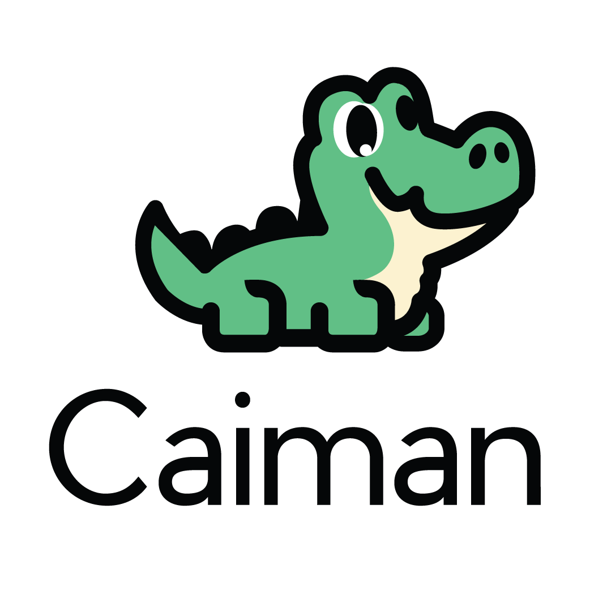

# CaImAn Central

A central hub for news about the [Caiman software package](https://github.com/flatironinstitute/CaImAn) for calcium imaging analysis. It will include information about workshops, community meetings, and any other caiman news.

## Release note notes
Not every release is notable, but we'll note some of the more signifiant bits here. 
- Release 1.10.0 (February 2023): major update to the anchor notebooks (cnmf and cnmfe). [Feedback welcome](https://github.com/flatironinstitute/CaImAn/discussions/1260)!

## Community meetings
Online meeting where developers and users meet. Devs get feedback from users, and users can learn about the latest updates for Caiman.    

- 2024: February 22    
- 2023 meetings were held in April, August, and November. 

## Workshops
- [November 2023 SFN Satellite Workshop page](https://github.com/flatironinstitute/caiman_central/tree/main/workshops/sfn_2023).
- [January 2023 Flatiron Workshop page](https://github.com/EricThomson/CCN_caiman_mesmerize_workshop_2023)
- [June 2022 Flatiron Workshop](https://indico.flatironinstitute.org/event/2800/overview)

---  
Caiman Central was born October 29, 2023. Last updated February 22, 2024.
